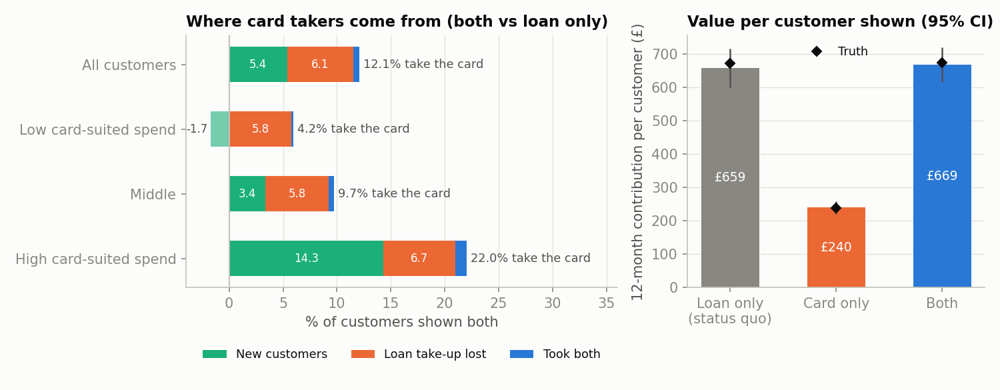
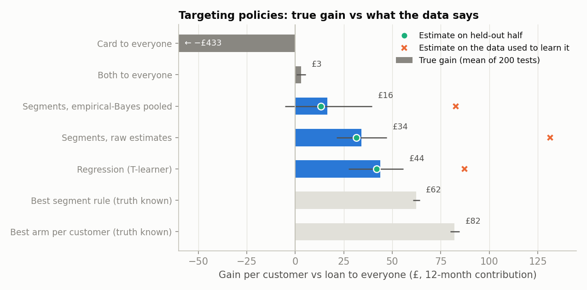
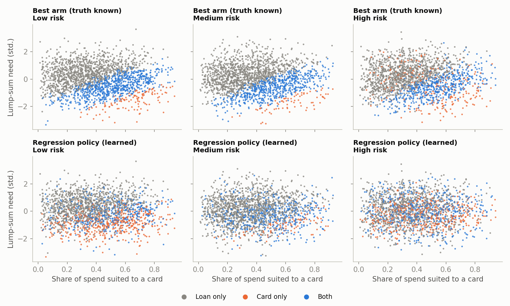

# Credit card or flexible loan? Who should see which, and does the card win new customers or take them from the loan?

Suppose a lender that offers a flexible business loan launches a business credit card. Two questions follow. **Does the card bring in extra customers, or does it take customers from the loan?** And **which customers should be shown the card, the loan, or both?** This repo builds that situation from scratch, answers both questions with a randomised three-arm test, and scores every targeting policy against the truth.

> **Synthetic data, stated up front.** Real lending data is private, so customers and their choices are simulated with known true parameters (`src/simulate.py`). That is deliberate: take-up, value and the best product for each customer are known, so every estimate and policy can be checked against ground truth over 200 simulated tests. No claim here is about any real company's products or performance. Customer behaviour, margins and default rates are my assumptions.

## The set-up

- **36,000 eligible businesses**, randomised equally to three arms: *loan only* (the status quo), *card only*, or *both*.
- Each business has two needs. A **lump-sum need** (stock, equipment, a tax bill) drives interest in the loan. The **share of its spending that suits a card** (software, advertising, travel) drives interest in the card.
- Shown both, a business picks none, the loan, the card or both (multinomial logit). Taking both is rare, and seeing two products at once lowers interest in each a little (divided attention). These two assumptions are what allow the card to take customers from the loan.
- Value is a **12-month contribution** per customer shown: margin minus credit losses. At the median, a loan is worth about £2,050 and a card about £810.

## Methods

- **Value by arm**: mean 12-month contribution per customer shown, with Welch intervals.
- **Cannibalisation decomposition** (`src/decompose.py`): card take-up in the both arm splits exactly into *net new customers* + *loan take-up lost* + *took both*, each a difference between randomised arms. Intervals come from a multinomial bootstrap.
- **Targeting policies** (`src/policy.py`), learned on half the data and valued on the other half:
  - 27 segments (risk × card-suited spend × lump-sum need, thirds of each), choosing the best arm per segment from raw estimates;
  - the same with **empirical-Bayes partial pooling** of segment effects toward the average;
  - a per-arm **regression (T-learner)** on a quadratic basis with interactions.
- **Policy value**: an unbiased estimate from the randomised data (for each arm, the mean of value × [policy chose this arm] over that arm's customers), compared with the known truth and with the over-optimistic estimate from the data used to learn the policy.

## Findings

### The card brings in new customers, but about as many loan customers move across



| Arm (12,000 each) | Loan take-up | Card take-up | Any product | Value per customer (95% CI) | True value |
|---|---|---|---|---|---|
| Loan only (status quo) | 23.5% | | 23.5% | £659 (601 to 716) | £673 |
| Card only | | 17.0% | 17.0% | £240 (221 to 259) | £239 |
| Both | 17.4% | 12.1% | 28.9% | £669 (616 to 721) | £675 |

Of the 12.1% of customers who take the card when shown both:

| Component | Estimate (95% CI) | Truth |
|---|---|---|
| Net new customers | 5.4pp (4.3 to 6.4) | 5.3pp |
| Loan take-up lost | 6.1pp (5.1 to 7.2) | 5.8pp |
| Took both | 0.6pp | 0.6pp |

- **About half of card take-up is new business; the other half replaces loans.** The split is *net*: if showing two products makes some people take neither, that shows up as fewer new customers and more lost loans. Bootstrap intervals for both components covered the truth in 95% and 95.5% of 200 simulated tests.
- **On average the card adds nothing in value.** Showing both is worth +£10 per customer (−£68 to +£88; true +£3). New card customers roughly offset the lost loans, which are worth about 2.5 times as much each. Showing the card *instead of* the loan loses £419 per customer (true −£434).
- **The average hides big differences.** For businesses with a high share of card-suited spending, the card brings in 14.3pp new customers against 6.7pp of lost loans. For those with little card-suited spending, it brings in *no* new customers (−1.7pp, interval −3.6 to +0.1; true −0.7pp) and costs 5.8pp of loans. There the extra choice only gets in the way.

### Who should see what: targeting is worth more than the launch decision



Gain per customer over "loan to everyone", over 200 simulated tests (policies learned on one half, valued on the other):

| Policy | True gain | Share of the best possible | Estimate on held-out half | Estimate on the data used to learn it |
|---|---|---|---|---|
| Card to everyone | −£433 | | −£435 | |
| Both to everyone | +£3 | 4% | +£1 | |
| Segments, empirical-Bayes pooled | +£16 | 20% | +£13 | **+£83** |
| Segments, raw estimates | +£34 | 42% | +£31 | **+£131** |
| Regression (T-learner) | **+£44** | **53%** | +£42 | **+£87** |
| Best segment rule (truth known) | +£62 | 76% | | |
| Best arm per customer (truth known) | +£82 | 100% | | |

1. **Targeting beats every "one product for everyone" rule.** Offering the right product to each customer is worth up to £82 per customer, while the launch decision alone is worth £3. The regression policy captures about half of that. It beat the status quo in all 200 tests.
2. **Scoring a policy on the data used to choose it is badly optimistic.** The raw segment policy looks like +£131 on its own training data and is really worth +£34, about four times less. The held-out estimate is close to the truth for every policy. **Always value a targeting rule on data it has not seen.**
3. **Partial pooling gave better estimates but worse decisions.** Shrinking segment effects toward the average roughly halved the error of the estimated "both" effects (RMSE £150 vs £282 per segment), but the policy built on them was worth less (+£16 vs +£34) and lost to the status quo in 24% of tests. The average effect of "both" sits near zero, which is exactly the decision line, so shrinking every segment toward it flips many decisions at once. Pooling toward a structured model (the regression) worked better than pooling toward one number.
4. **Coarse segments cap the prize.** Even with the truth known, the best 27-segment rule reaches only 76% of the per-customer optimum.



In the example test, the learned regression policy agrees with the true best arm for 62% of customers. It gets the broad picture right: the loan where lump-sum need is high, both where card-suited spending is high. But it offers *card only* far more often than it should (17% vs 7% overall; 24% vs 6% for low-risk and 24% vs 13% for high-risk businesses). A misplaced card-only offer is expensive, since it gives up the loan, so this is where a better model would earn most.

## Limitations

- Simulated data. The choice model, the attention cost of showing two products, margins and default rates are my assumptions. The headline "the card adds nothing on average" follows directly from them: without the attention cost, showing both would be worth about +£140 per customer.
- Value is a 12-month contribution. Cards and loans differ in how long customers stay and how they grow, so a longer horizon (see [`prequalification-clv`](https://github.com/Max-Isse/prequalification-clv) for handling incomplete follow-up) could change the ranking.
- One offer per customer and no repeat exposure. In practice the card might be offered later to loan customers (cross-sell timing), which this does not model.
- Policy learning uses simple, transparent methods. Causal forests or doubly robust learners would be natural next steps, valued the same way on held-out data.
- Built with AI assistance (Claude). The code is checked against known answers in `tests/`, and every number above comes from `run_all.py`.

## Run it

```bash
pip install -r requirements.txt
python run_all.py          # about 30 seconds; regenerates figures/ and results/
python tests/test_core.py  # 6 checks against known answers
```

Developed with Python 3.11.15, numpy 2.2.6, pandas 3.0.2, scipy 1.13.1 and matplotlib 3.10.9.

## Layout

```
src/simulate.py     customers, choice model, product values and true outcomes
src/decompose.py    new vs lost-loan decomposition, multinomial bootstrap
src/policy.py       segment and regression policies, empirical-Bayes pooling, policy value
src/style.py        plot style
run_all.py          single test, 200-test Monte Carlo, figures
tests/test_core.py  checks against known answers
results/            tables, JSON summary, run log
figures/            charts used above
```

Related repos: [`partner-funnel-analysis`](https://github.com/Max-Isse/partner-funnel-analysis) (funnel diagnosis, Bayesian partner estimates, sequential experiments), [`topup-causal-inference`](https://github.com/Max-Isse/topup-causal-inference) (measuring launches that were not randomised) and [`prequalification-clv`](https://github.com/Max-Isse/prequalification-clv) (pre-qualification, CLtV under incomplete follow-up and model development).
